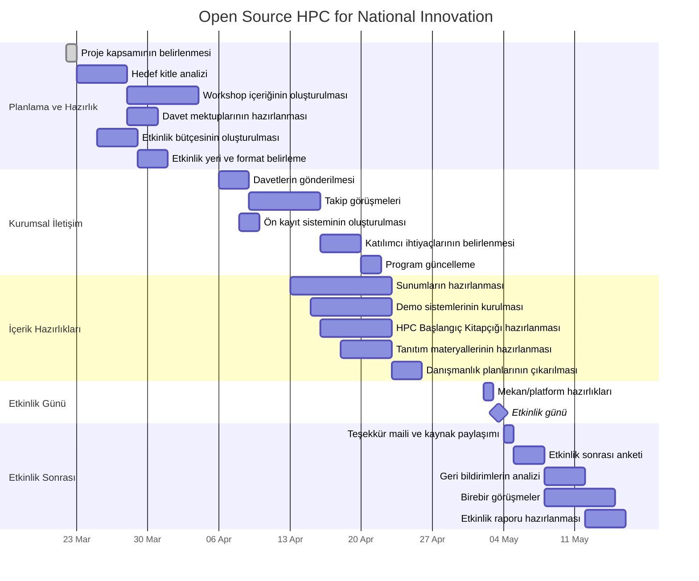

# Open Source HPC for National Innovation - Proje Zaman Çizelgesi

## Önemli Tarihler ve Kilometre Taşları

| Tarih | Kilometre Taşı / Etkinlik |
|-------|---------------------------|
| 22 Mart 2025 | Proje başlangıcı |
| 5 Nisan 2025 | Planlama ve hazırlık aşamasının tamamlanması |
| 6 Nisan 2025 | Kurumsal iletişim ve davet sürecinin başlaması |
| 19 Nisan 2025 | Davet sürecinin tamamlanması, katılımcı listesinin netleşmesi |
| 26 Nisan 2025 | Tüm içerik ve demo hazırlıklarının tamamlanması |
| 3 Mayıs 2025 | **Etkinlik Günü** |
| 10 Mayıs 2025 | Geri bildirimlerin toplanması ve analizi |
| 17 Mayıs 2025 | Proje değerlendirme raporunun tamamlanması |

## Haftalık İş Planı

### Hafta 1 (22-29 Mart 2025)
- Proje kapsamının ve hedeflerinin netleştirilmesi
- Hedef kitle ve kurum analizinin yapılması
- Etkinlik bütçesinin oluşturulması
- Proje takip sisteminin kurulması

### Hafta 2 (30 Mart - 5 Nisan 2025)
- Workshop içeriğinin taslağının tamamlanması
- Davet mektuplarının hazırlanması
- Etkinlik yeri ve formatının kesinleştirilmesi
- Demo senaryolarının planlanması

### Hafta 3 (6-12 Nisan 2025)
- Davetlerin gönderilmesi
- Ön kayıt sisteminin oluşturulması
- Sunum içeriklerinin hazırlanmaya başlanması
- Teknik ekibin demo hazırlıklarına başlaması

### Hafta 4 (13-19 Nisan 2025)
- Takip görüşmelerinin tamamlanması
- Katılımcı listesinin netleştirilmesi
- Sunum içeriklerinin geliştirilmesi
- Demo sistemleri için donanım kurulumu

### Hafta 5 (20-26 Nisan 2025)
- Tüm sunumların tamamlanması
- Demo sistemlerinin test edilmesi
- HPC Başlangıç Kitapçığının tamamlanması
- Etkinlik programının son haline getirilmesi

### Hafta 6 (27 Nisan - 3 Mayıs 2025)
- Son hazırlıkların tamamlanması
- Mekan/platform hazırlıklarının yapılması
- Etkinlik günü (3 Mayıs)

### Hafta 7 (4-10 Mayıs 2025)
- Teşekkür maili ve kaynak paylaşımı
- Etkinlik sonrası anketinin gönderilmesi
- Geri bildirimlerin toplanması
- İlk birebir görüşmelerin başlaması

### Hafta 8 (11-17 Mayıs 2025)
- Geri bildirimlerin analiz edilmesi
- Birebir görüşmelerin devam etmesi
- Etkinlik değerlendirme raporunun hazırlanması
- Gelecek etkinlikler için önerilerin oluşturulması

## Risk Yönetimi Zaman Çizelgesi

| Risk | İzleme Periyodu | Kontrol Tarihi | Sorumlular |
|------|-----------------|----------------|------------|
| Düşük katılım | Haftalık | 19 Nisan 2025 | İletişim Ekibi |
| Teknik aksaklıklar | Günlük | 26 Nisan 2025 | Teknik Ekip |
| Bütçe aşımı | İki haftada bir | 12 Nisan, 26 Nisan | Finans Sorumlusu |
| İçerik gecikmesi | Haftalık | Her Cumartesi | İçerik Ekibi |
| Mekan sorunları | İki haftada bir | 12 Nisan, 26 Nisan | Organizasyon Ekibi |

## Notlar
- Zaman çizelgesi, projenin ilerleyişine göre güncellenebilir
- Kritik görevlerde gecikme olması durumunda proje yöneticisine hemen bilgi verilmelidir
- Haftalık durum toplantıları her Pazartesi saat 10:00'da yapılacaktır
